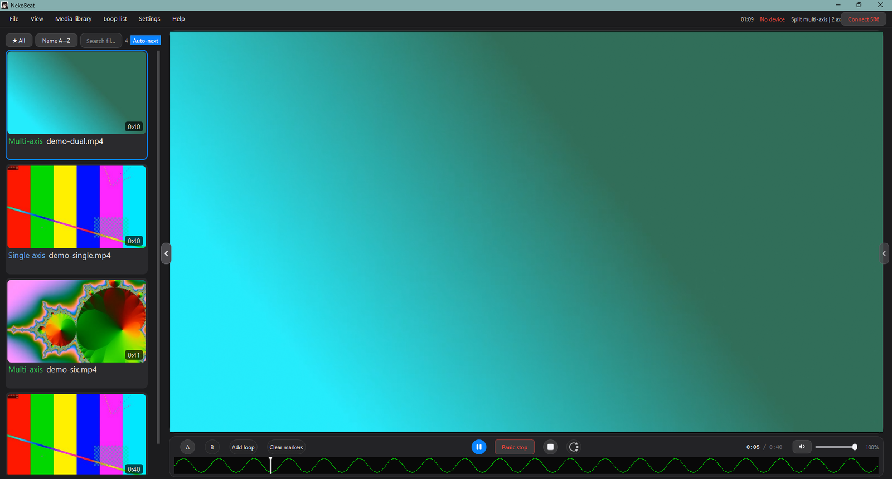
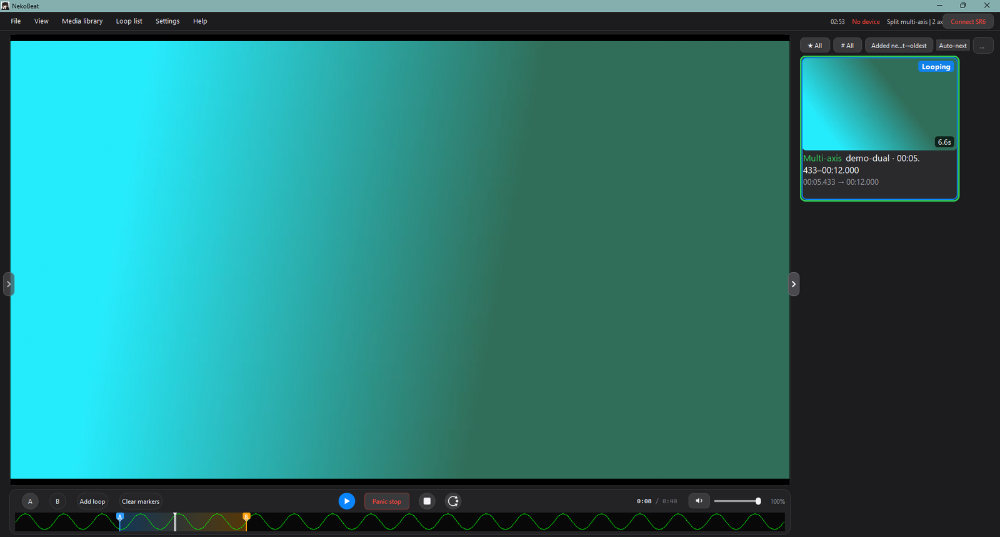
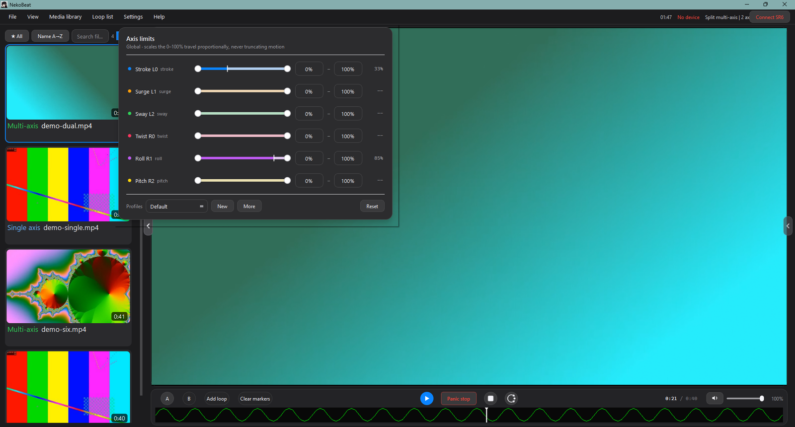

# NekoBeat

[English](README.md) | [简体中文](README.zh-CN.md)

NekoBeat is a multi-axis funscript video player for Windows. It reads funscripts exported by OpenFunScripter, converts multi-axis motion into TCode v0.3 commands in real time, sends them to devices such as the SR6 and OSR2 over a serial port, and plays the matching video in sync.

The name comes from the catgirl in the icon: *Neko* (cat) + *Beat*.

**Current version: 1.0.0**



## Features

### Playback and sync

- Video is played through libmpv 2 in a Qt Widgets interface, with the picture on an OpenGL surface.
- Play, pause, stop, recentre and seek, with three seek-safety levels (Safe / Standard / Fast) plus an advanced custom setting.
- Optional smoothing for play and pause: resuming eases the device into the script, and pausing coasts to the end of the current stroke (at most 0.6 s) before stopping. Switching video, disconnecting, quitting and emergency stop always stop immediately.
- Right-click the picture to pause or resume, double-click it or press F11 for full screen, and Esc to leave full screen.
- In full screen the control bar hides itself and slides back when the pointer reaches the bottom edge; the pointer and the bar fade out together after three seconds of stillness. The side panels come and go as the pointer touches the left or right screen edge.
- The status bar shows the largest phase lag of the most recent statistics window (`Sync ±N ms`), so a stutter that is holding the device back is visible at a glance.

### Media library

- Cover grid with duration, an axis-count badge, a detail pane, search, filters and sorting.
- Scanning runs on a background thread, so it neither freezes the interface nor disturbs playback.
- Thumbnails are cached. A file that has moved can be relinked from the library, and clearing the thumbnail cache never affects favourites.
- Favourites: right-click a card to file it under any number of collections, filter the panel by collection, and create, rename, reorder and prune collections in a management window.

### Loops



- Mark a range with the A/B buttons, then give it a title, tags, a loop collection and a note.
- Double-click a loop card to play that range on repeat. Playback eases back to the A point through a safety ramp when it reaches B.
- Filter and sort loops by collection, tag or keyword. A video can hold any number of loops.

### Heatmap

- The colour band above the control bar doubles as the progress bar, drawn stroke by stroke in five colour steps (green → yellow → orange → red → dark red), with 0 % and 100 % hugging the edges.
- Click or drag to seek. While dragging, only the picture follows the pointer and the device stays still; releasing eases the device to the position you released at and resumes sync.

### Axis control



- **Axis limits** (`Settings › Axis limits…`): scales the travel of each axis and stores any number of profiles that can be imported and exported. With playback stopped, dragging a limit slider, or clicking the 0 % / 100 % handle, drives the device to that limit so the travel can be compared directly.
- **Calibration and test** (`Settings › Axis calibration and test…`): sets the minimum, maximum, home position, inversion and script offset of each axis in raw values (0–9999), with three buttons that really drive 0 %, 100 % and the centre. Values can be edited without a device connected; the driving buttons are disabled while it is disconnected.
- Home behaviour is per axis: position axes return to their configured home point, while amplitude channels such as vibration and lubrication return to 0 (a true stop).
- After connecting, the supported axes (`D0/D1/D2`) are identified first. No motion command is sent before that finishes, so axes the device does not have are never addressed.

### Device link

- The device link (serial port, handshake, motion timer and TCode encoding) runs on its own thread, so a stuttering interface no longer delays device commands.
- USB serial and Bluetooth serial (classic SPP) are supported. Bluetooth ports are labelled `Bluetooth serial · <device>` and are retried more patiently than USB.
- Per-command TCode logging is off by default and can be enabled under `Settings › Log every TCode command (diagnostics)`; the environment variable `NEKOBEAT_TCODE_LOG=1` overrides it. While it is off, one statistics line is written every five seconds.

### Interface

- Dark, minimal layout: menu bar, media library on the left, video and control bar in the middle, loop list on the right. The two side panels can swap places.
- The interface language defaults to English; `Settings › Language` switches between English and Simplified Chinese and the choice is remembered across restarts.
- The library splitter follows the pointer, and columns appear and disappear with hysteresis so that resizing does not flicker.

## Device support

There is no built-in device list: NekoBeat speaks TCode v0.3 over a serial port, and once connected it asks the device which axes it has and only ever drives those. So the table below is about the connection, not the model — an SR6, OSR2, SR2, OSR6 or any other TCode device should work. It has only been tested on a generic SR6; if a firmware does not answer the `D0` / `D1` / `D2` axis query, NekoBeat falls back to the SR6 six-axis preset.

| Connection | Status | Notes |
| --- | --- | --- |
| USB serial (wired) | Supported | Connect the device over USB. Once a port such as `USB-SERIAL CH340` appears in the system, select it and connect. |
| Bluetooth serial (classic SPP) | Supported | The device firmware must expose Bluetooth as a serial passthrough, as most ESP32-based TCode firmwares do. Pair it in Windows first, then pick the port labelled `Bluetooth serial · <device>`. |
| BLE only (low energy) | Not supported | Devices that do not create a serial port, such as Nordic UART, would need a native Bluetooth transport that is not implemented yet. |
| WiFi / network API (for example Handy in WiFi mode) | Not supported | These need a per-vendor adapter layer. |

### Checking whether your device works over Bluetooth

1. Pair the device in Windows under *Bluetooth & devices*.
2. Open NekoBeat and click **Connect SR6** in the top right corner. If an entry labelled `Bluetooth serial · <device>` appears, the device can be used over Bluetooth.
3. If you only see `Bluetooth serial (local incoming port)`, or no serial port appeared after pairing, the Bluetooth side of the device is not an SPP serial link and this version cannot use it. Use the USB cable instead.

> In some cases the port does not appear on its own after pairing. Add it manually under *More Bluetooth settings › COM ports › Add › Outgoing*.

Once connected, the status line names the link in use, for example `COM5 · Bluetooth SR6-BT · SR6-Alpha5-ESP32 · TCode v0.3`. Hover over it to read the full text in a narrow window.

## Requirements

- Windows 10 or 11, 64-bit
- Qt 6.9.3 (MinGW x64)
- MinGW 13.1
- CMake 3.24 or newer
- libmpv 2 development package (fetched by `scripts\fetch_deps.ps1`)
- A device that accepts TCode v0.3 over a serial port (SR6, OSR2 and similar)

## Building from source

```powershell
.\scripts\fetch_deps.ps1
.\scripts\build.ps1
```

`fetch_deps.ps1` downloads the pinned libmpv build into `third_party\mpv` and verifies its SHA-256. `build.ps1` configures and builds into `build`, runs the unit tests with `ctest`, copies `libmpv-2.dll` next to the executable and collects the Qt runtime with `windeployqt`.

The build directory is always `build`. MinGW Makefiles cannot handle non-ASCII paths, so when the source tree sits under a path containing non-ASCII characters the script temporarily maps the parent folder to a free ASCII drive letter; the source itself does not move.

If your Qt and MinGW are not in `C:\Qt`, both scripts accept a `-QtDir` / `-MinGwDir` override.

## Packaging

Portable package (the version in the file name is read from `CMakeLists.txt`):

```powershell
.\scripts\package_portable.ps1
```

Source package, exported straight from the commit you want to release:

```powershell
git archive --format=zip -o dist\NekoBeat-1.0.0-Source.zip HEAD
```

The source package does not contain `third_party/mpv`; anyone building from it runs `scripts\fetch_deps.ps1` first.

## Where your data is stored

- `%APPDATA%\NekoBeat\` — `favorites.json`, `loops.json`, and the media library cache under `library\` (`index.json` and `thumbs\`).
- Axis limit profiles, calibration values and interface settings live in the registry under `HKEY_CURRENT_USER\Software\NekoBeat\NekoBeat`.

Nothing is uploaded anywhere and there is no telemetry.

## Safety

NekoBeat drives physical hardware. Keep the emergency stop within reach, start with conservative axis limits, and test a new script at low travel before letting it run at full range.

## License

NekoBeat is free software: you can redistribute it and/or modify it under the terms of
the GNU General Public License as published by the Free Software Foundation, either
version 3 of the License, or (at your option) any later version.

Copyright (C) 2026 Ftsuk

See [LICENSE](LICENSE) for the full text.
